# VPC Diagram

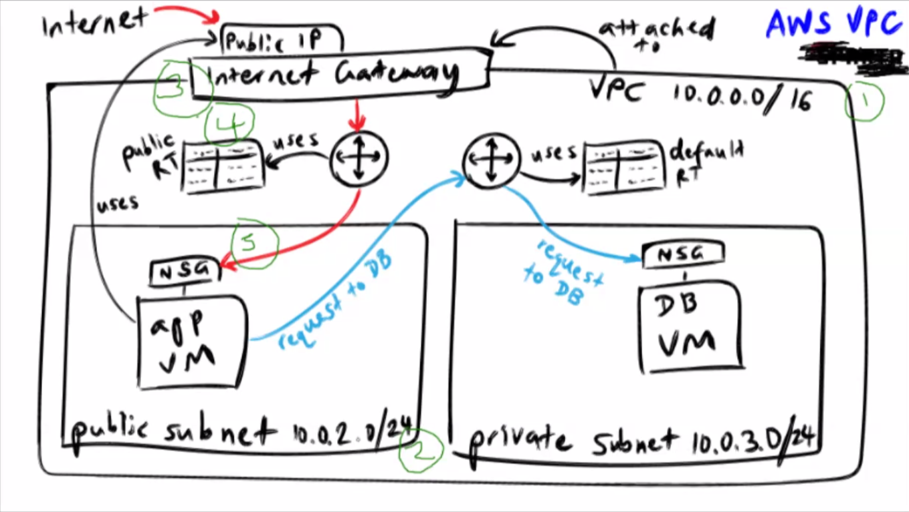

## 1. Make the VPC

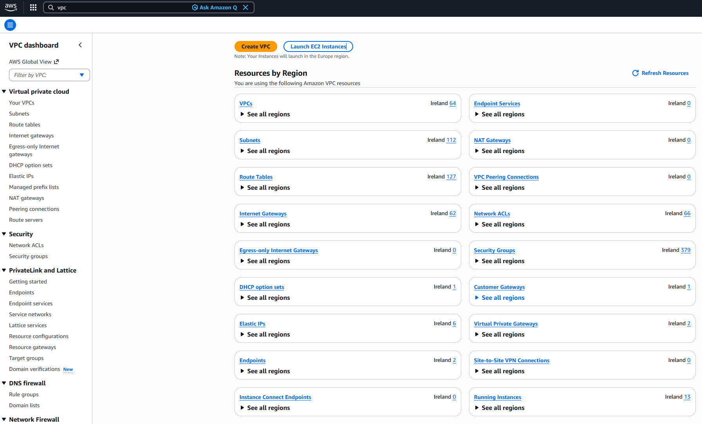

    - Click orange "Create VPC" button.

### Settings:

    - Click "VPC only"
    - Name: se-<name>-first-2tier-vpc
    - IPv4 CIDR block: IPv4 CIDR manual input
    - IPv4 CIDR: 10.0.0.0/16 - This means every internal address has to start with 10.0. The block is in 8s and the / is how many blocks are static. Possible IPs inside the VPC are 10.0.<0-255>.<0-255>
    - IPv6 CIDR block: No IPv6 CIDR block
    - Tenancy: Default - The options are "Default" and "Dedicated", if it is dedicated, it means that no other organisation runs on that hardware infrastructure, while default means it is shared with other clients.
    - VPC encryption control ($): None
    - Tags: default.

    - Click orange create VPC button

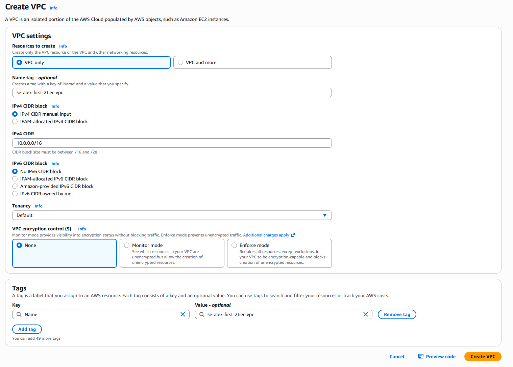

## 2. Make the Public and Private Subnets

    - Navigate to subnets on the left hand side of the page

    - click orange "Create subnet" button

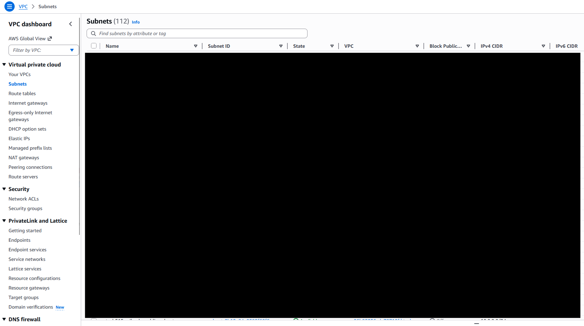

### Settings:

    - VPC: The VPC you just created (se-<name>-first-2tier-vpc)
    - Subnet Settings:
        - Subnet name: se-<name>-public-subnet
        - Availability Zone: Europe (Ireland) / eu-west-1a
        - IPv4 VPC CIDR block: 10.0.0.0/16
        - IPv4 subnet CIDR block: 10.0.2.0/24 (Must be smaller than VPCs)
        - Tags: default

    - Click "Add new Subnet" button

    - Subnet Settings:
        - Subnet name: se-<name>-private-subnet
        - Availability Zone: Europe (Ireland) / eu-west-1b
        - IPv4 VPC CIDR block: 10.0.0.0/16
        - IPv4 subnet CIDR block: 10.0.3.0/24
        - Tags: Default

    - Click "create subnets" button 

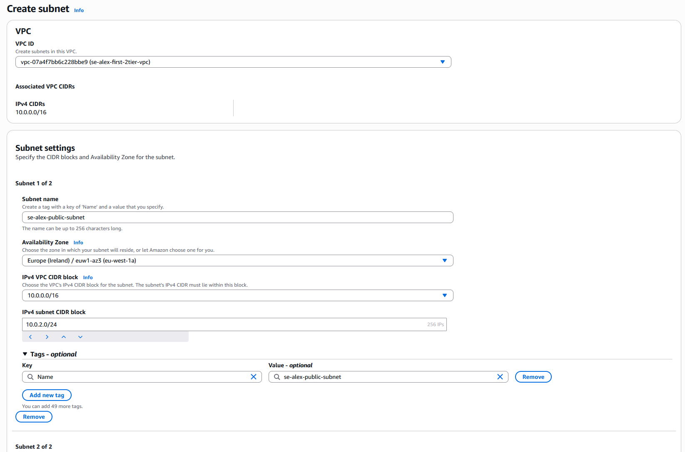
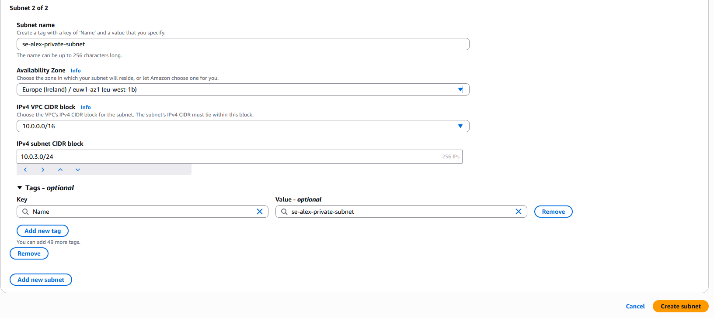

## 3. Create Internet Gateway

    - Go to "Internet Gateway" on left hand menu
    - Click "Create internet gateway" button

### Settings:

    - Name Tag: se-<name>-2tier-vpc-ig
    - Tags: Default

    - Click "create internet gateway"

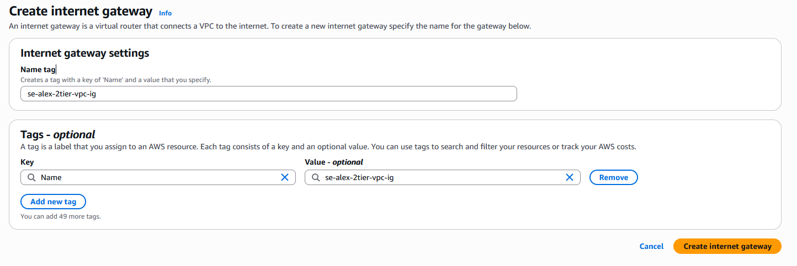
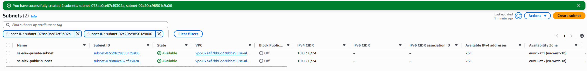

    - Attatch VPC:

        - Options dropdown
        - Attatch VPC

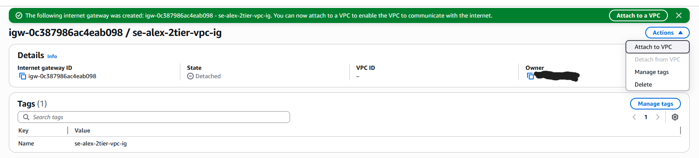
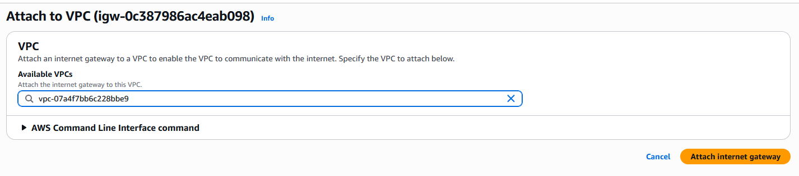

## 4. Make Route Tables

    - Route table on the left hand menu
    - Click "Create route table" button

### Settings:

    - se-alex-2tier-vpc-public-rt
    - VPC: Your VPC from earlier

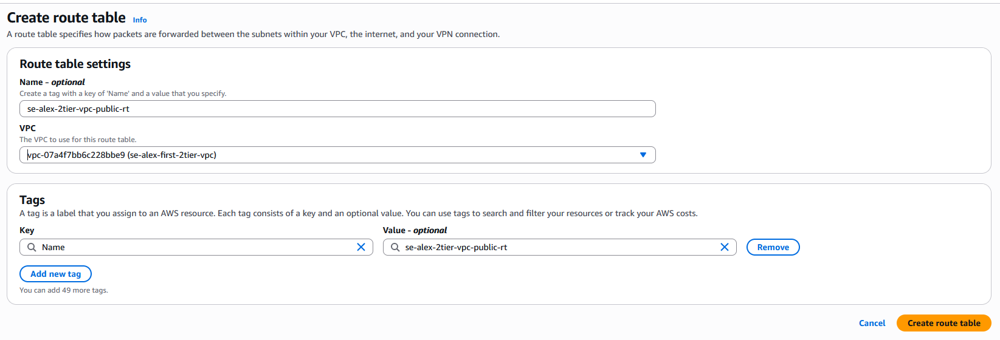

    - Addint route table to subnet:

        - Go to "Subnet associations" tab
        - Click "Edit subnet associations"
        
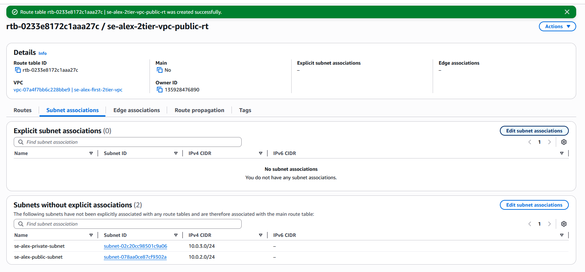
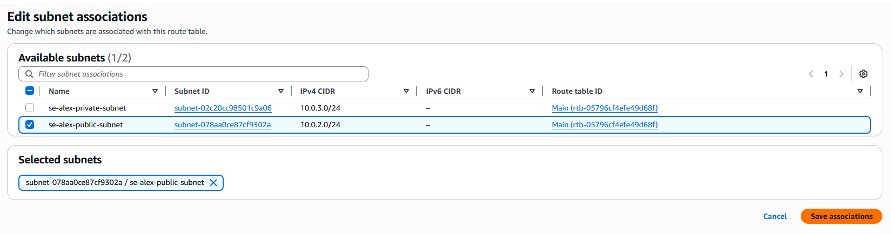
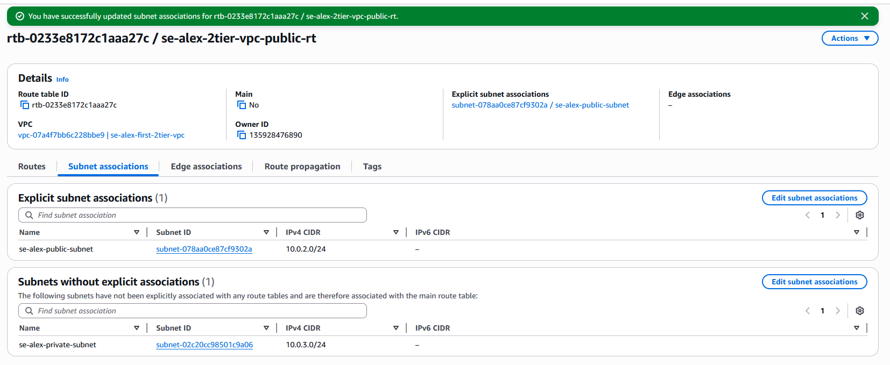

    - Go to "routes" tab
    - Click on "edit routes"
    - Click "Add route"

    Settings:
        - Destination: 0.0.0.0/0
        - Target: Internet Gateway, Add your internet gateway

    - Click "save changes"

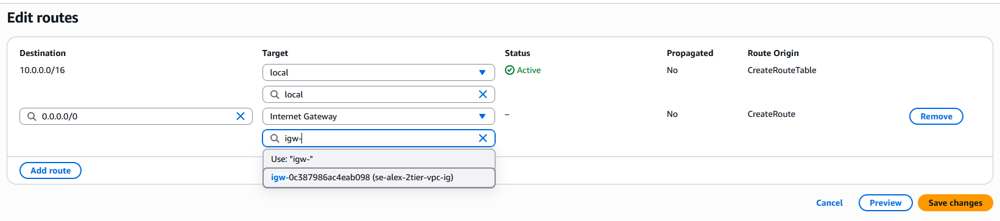
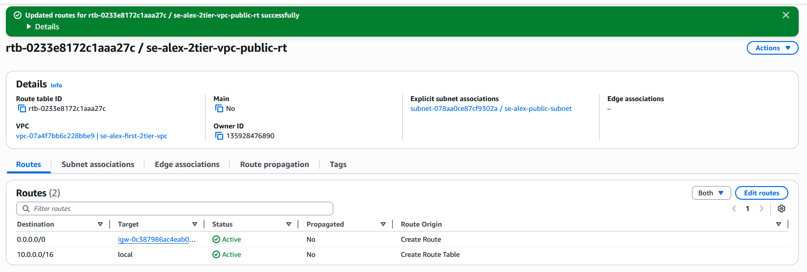

    - This should show in your resource map

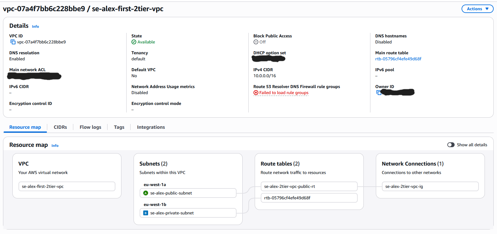

## 5. Add Security Group

    - Launch EC2 images with your database image
        - Use these security group settings:

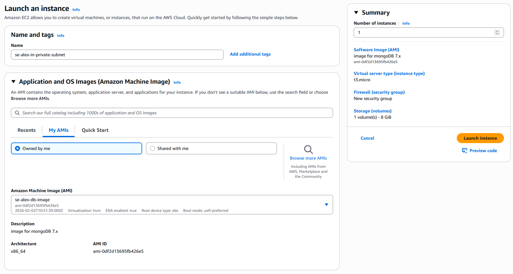
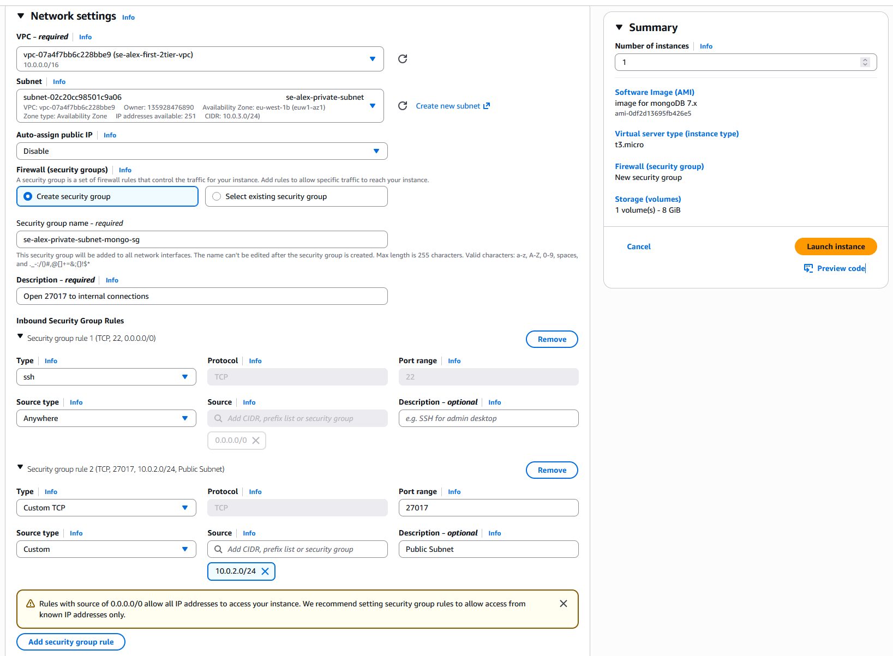

    - Launch EC2 images with your app image
        - Use these security group settings:

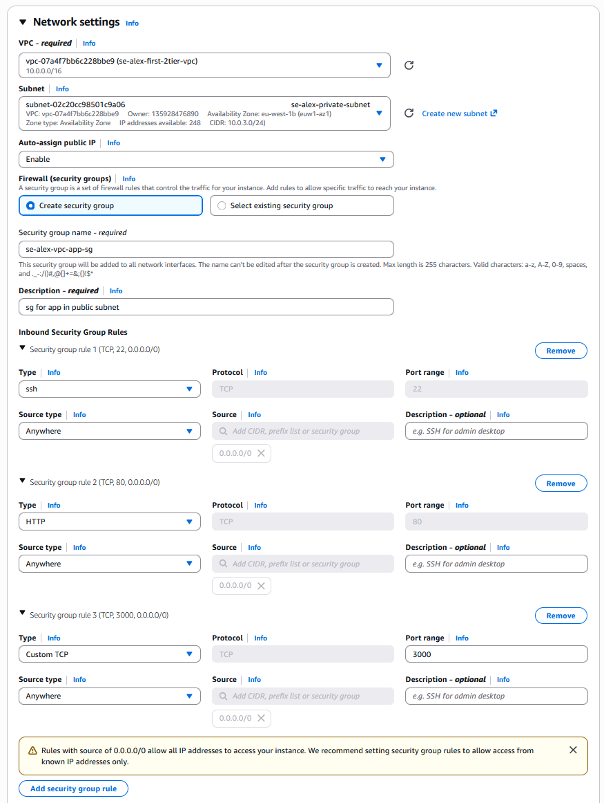

    

Remake the VPC again, document in depth this time (Screenshots and step by step guidance). Steps below (at a glance)
    Make VPC (10.0.0.0/16)
    Make Subnets (10.0.2.0/24 and 10.0.3.0/24)
    Create IG and attach to VPC
    Create Public RT
    Associate with public subnet
    Add route to the internet via IG  (0.0.0.0/0)
    Check setup
    Try to deploy app and db
    Try to automate app and db deployment in your VPC by using your own images and user data 

 

