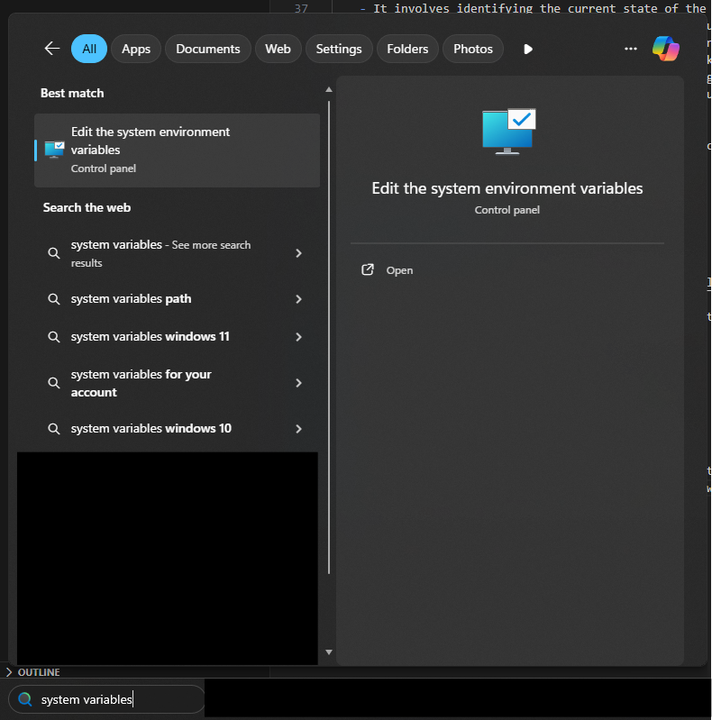

    
Tasks:
    Research IaC and Terraform
    What is IaC?
    What are the benefits?
    Who is using it?
    Orchestration vs Config Management?
    What is Terraform?
    How does it work?
    Install TF locally
    Document the installation process

## What is IaC (Infrastructure as Code)

    - The managing and provisioning of infrastructure through code instead of manual processes.
    - Has two subcategories of Orchestration and Config Management 

- Benefits:
    - Launches the same way every time
    - Removes human error
    - Standardised
    - Faster
    - Scalable
    - Allows advanced infrastructure such as containers.
    - Version Control

- Orchestrarion
    - Like building the house
    - Orchestration is the process of automating and coordinating complex workflows and tasks within an IT infrastructure.
    - It involves managing the interactions and dependencies between different systems, services, and applications to ensure that they work together seamlessly to achieve a specific goal. 
    - Orchestration can involve a variety of tasks, such as provisioning and configuring resources, deploying applications, and monitoring performance. It is often used to manage the deployment of virtual machines(VM) and containers across multiple servers or data centers.
    - Orchastration tools include Terraform.

- Configuration Management
    - Like decorating the house
    - Maintaining and updating configurations of an IT infrastructure
    - It involves identifying the current state of the infrastructure, defining the desired state, and implementing changes to move from the current state to the desired state. 
    - Configuration management helps ensure that the infrastructure is consistent, reliable, and secure. It also enables administrators to track changes, troubleshoot issues, and maintain compliance with industry standards and regulations. 
    - Some popular configuration management tools include Ansible, Puppet, Chef, SaltStack, and CFEngine.

- Terraform is used to create and destroy cloud resources in an automated, scalable, fast and hands-off way.
    - Can connect to multiple cloud service provdiers.


## Installing Terraform

- Go to:
    - https://developer.hashicorp.com/terraform/install

- Download the appropriate version for your system (Intel or AMD processor)
- Extract the contents of the file
- Copy the terraform.exe file
- Go to C://Program Files
- Create a new folder called "Terraform"
- Go into the "Terraform" folder you just created
- Paste the "terraform.exe" into the folder

### Now we need to add the folder to the system path:

1. Click the top of the files browser with the file path and copy said file path
2. Type "System Variables" into the search bar on the windows 11 taskbar



3. Click "environment variables" at the bottom of the window
4. Select "Path" in the second box and click "edit".
5. Click "New" and paste the file path from earlier.
6. Click "Ok" to close all 3 system windows

### Check it worked

- Open the command line and run:

```
terraform --version
```

- If it comes back with a version number, it has been successfully installed.