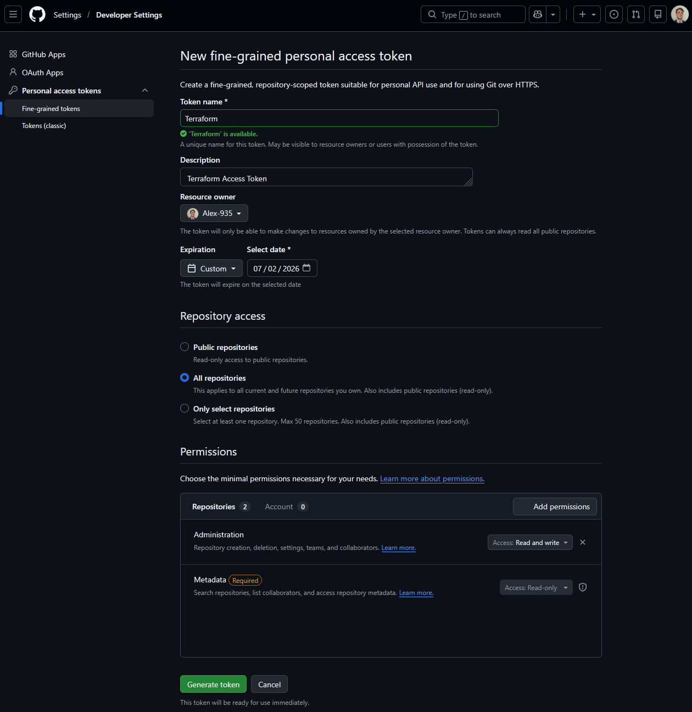

## Tasks:
1. Improve ec2 creation main.tf
    Add key pair
    Assign SG
    Assign vpc + subnet?
    etc.

2.  Create a SG with tf (new project)
3.  Combine the two (Make SG and then create EC2)
4.  Get TF to make a GitHub repo for you (on your account)
5.  Experiment with terraform variables

    Document everything!


## Making a github repo with terraform

- Inside GitHub, generate a Personal Access Token
- click on settings → Developer settings → Personal access tokens → Fine-grained tokens → Generate new token
- Give it a name and expiration date
- Select repositories as "All repositories"
- Under "Repository Permisions", set "Administration" to "Read and Write".
- Generate Token

- Copy the token



### main.tf file:
```
provider "github" {
  token = "<token>"
}

resource "github_repository" "example" {
  name        = "example"
  description = "My awesome codebase"

  visibility = "public"
}
```

- Cd into main.tf folder
- terraform init // to create dependencies for github
- terraform fmt // to reformat code to terraform standards
- terraform plan // check if repo exists or not 
- terraform apply // same as plan and creates if you're happy